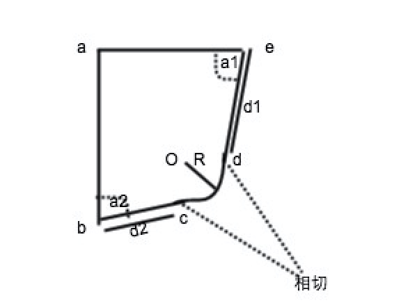

### @author yunyou 
### welcome to star [my Euler Project](https://github.com/csyunyou/Euler ) which is written in JavaScript
## 三维cad秋季考试 
1. B-rep,CSG,DM的特点
2. kemr()伪代码
3. CSG表示转voxel表示算法步骤
4. 倒边算法步骤
5. 生成镜像B-rep算法步骤
6. 设计特征和基本体素的区别
7. 题目:
    - 参数化设计的基本步骤
    - 画出下面系统模型的几何约束图,并求该模型的约束度，自由度
    
    
